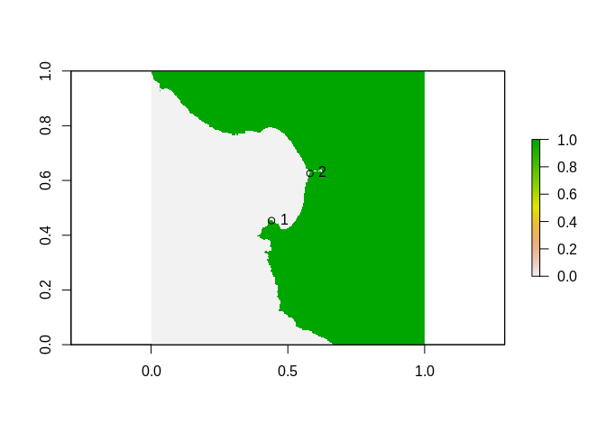
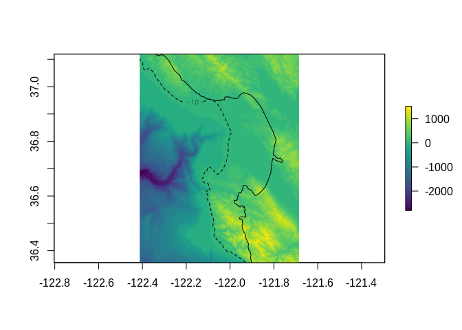

<!-- README.md is generated from README.Rmd. Please edit that file -->
<!-- badges: start -->

[](https://travis-ci.org/hypertidy/affinity)[](https://ci.appveyor.com/project/hypertidy/affinity)[](https://codecov.io/gh/hypertidy/affinity?branch=master)[](https://CRAN.R-project.org/package=affinity)
[](https://github.com/hypertidy/affinity/actions)
<!-- badges: end -->

# affinity

The goal of affinity is to provide the basic tools used for raster grid
georeferencing. This includes:

-   the affine transform
-   the world file model
-   the GDAL RasterIO window model
-   basic tools for performing grid calculations
-   simple control point georeferencing for un-mapped rasters.

The main use at the moment is the ability to get a geotransform from an
extent and dimension, this makes it easy to drive GDAL functions and to
compare with the RasterIO logic in the sf package raster reader.

The main functions for georeferencing are `affinething()` to collect
drawn points interactively from an un-mapped raster image and `domath()`
to calculate the extent of the raster in geographic terms and
`assignproj()` to apply a map projection inline. There are some other
experimental functions to write GDAL VRT `gdalvrt()` and to store some
known cases for unmapped image sources.

The basic tools still rely on the raster package.

## Installation

You can install the dev version of affinity from
[GitHub](https://github.com/hypertidy/affinity/) with:

``` r
devtools::install_github("hypertidy/affinity")
```

## Example

This examples takes an an un-mapped raster and
[georefences](https://en.wikipedia.org/wiki/Georeferencing) it by
defining some control points for a simple (offset and scale) [affine
transformation](https://en.wikipedia.org/wiki/Affine_transformation).

Generally, we want **diagonal points**, so I tend to think “southwest”
and “northeast”, it doesn’t really matter where they are as long as
there’s some pixels between them in both directions. Monterey Bay is
very recognizable so I read off some long-lat control points using
[mapview](https://r-spatial.github.io/mapview/).

``` r
library(affinity)
data("montereybay", package = "rayshader")


library(raster)
#> Loading required package: sp
## we know that rayshader works transpose
r <- t(raster(montereybay))

prj <- "+proj=longlat +datum=WGS84"
## the north tip of Pacific Grove
sw <- c(-121.93348, 36.63674)
## the inlet at Moss Landing
ne <- c(-121.78825, 36.80592)
#mapview::mapview(c(sw[1], ne[1]), c(sw[2], ne[2]), crs = prj)
```

We can obtain raw (graphics) coordinates of those locations from our
image, by plotting it and clicking twice with `affinething()`.

Note the order, the first point is “sw” and the second is “ne” - the
order is not important but it must match.

``` r
## mask the raster so we can see easily where we need to click
xy <- affinething(r > 0)
```

In this example the points are

``` r
xy <- structure(c(0.65805655219227, 0.858931100128933, 0.367586425626388, 
0.589597209007295), .Dim = c(2L, 2L), .Dimnames = list(NULL, 
    c("x", "y")))
```



Now we have everything we need to re-map our raster! We don’t need to
project our points as the known locations are in the same coordinate
system as the source data. (In other situations we might georeference
using a graticule on a projected map.)

``` r
mapped <- assignproj(setExtent(r, domath(rbind(sw, ne), xy, r, proj = NULL)), prj)

m <- rnaturalearth::ne_countries(country = "United States of America", scale = 10)
plot(mapped, col = viridis::viridis(30))
plot(m, add = TRUE)
contour(mapped, levels = -10, lty = 2, add = TRUE)
```



``` r
#mv <- mapview::mapview(mapped)
```

------------------------------------------------------------------------

Please note that the ‘affinity’ project is released with a [Contributor
Code of
Conduct](https://github.com/hypertidy/affinity/blob/master/CODE_OF_CONDUCT.md).
By contributing to this project, you agree to abide by its terms.
